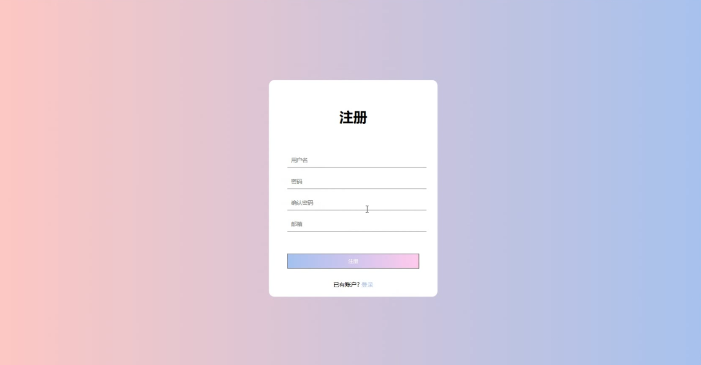
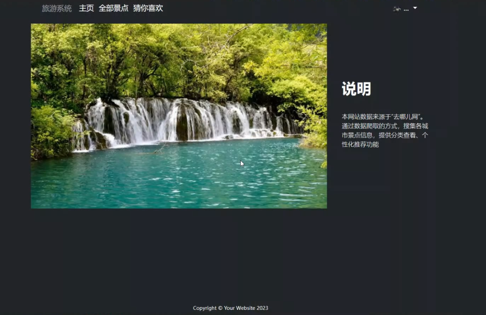
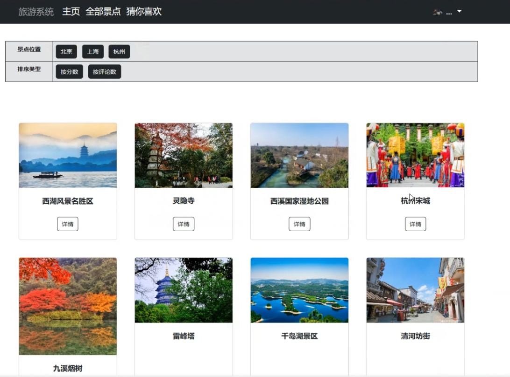
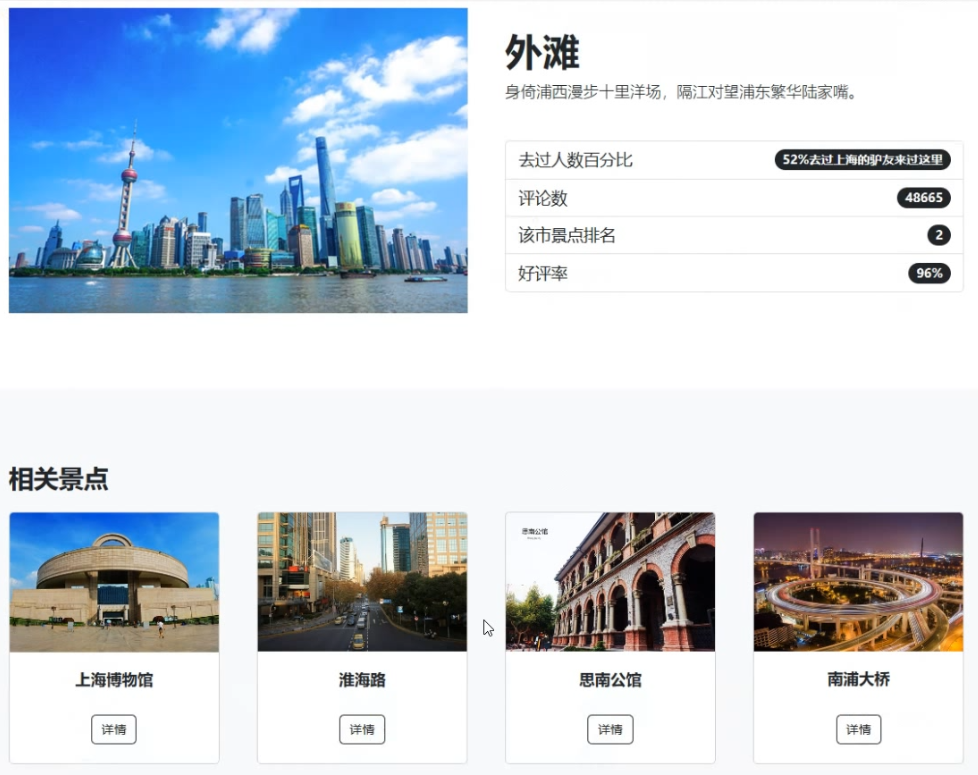
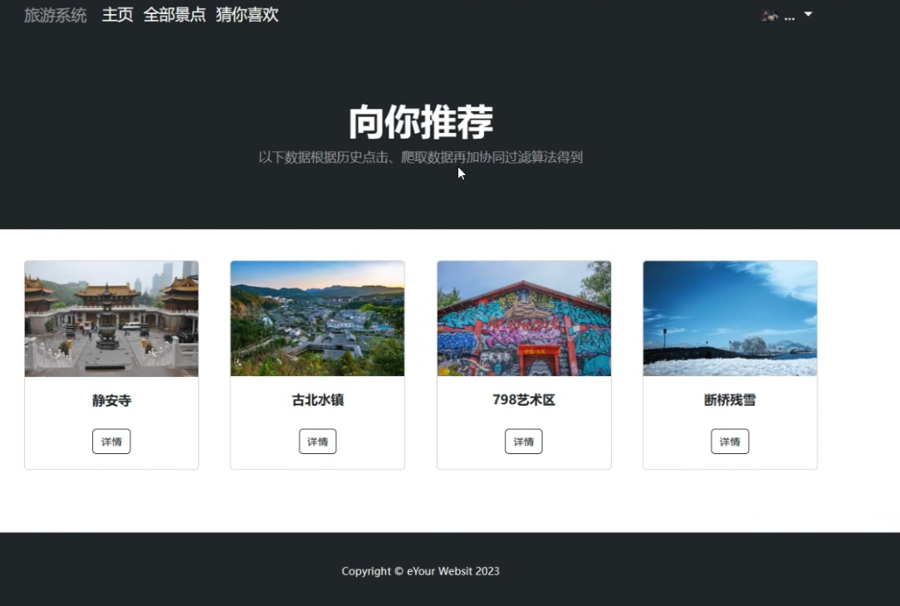
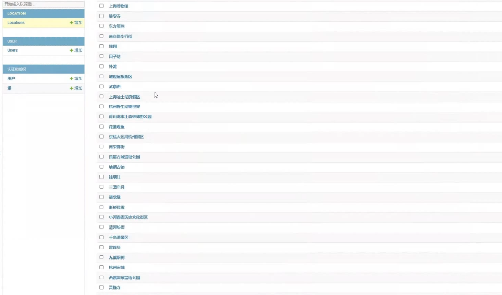

# TourSystem

## 基于协同过滤的旅游推荐系统

架构：Django、Bootstrap、mysql

### 功能描述：
* 用户登录注册
* 管理员管理后台数据(django自带)
* 爬虫爬取"去哪儿网"景点数据并存储
* 爬虫爬取"去哪儿网"旅游攻略帖子
* 景点及详情展示
* 根据用户历史点击记录进行基于物品协同过滤推荐

### 图片展示：

* 源代码+录视频讲解项目结构和功能：150 RMB
* 源代码+录视频讲解项目结构和功能+万字论文/报告：250 RMB
* 源代码+录视频讲解项目结构和功能+万字论文/报告+远程控制配置环境并运行：300 RMB

### 闲鱼：比奇堡的章鱼哥（优先）
### 微信：Neverland_996
### QQ：2914623954

其他C++\Python需求也可咨询，含数据结构，操作系统等在线考试\远程帮助，爬虫，数据可视化，文本分类等
